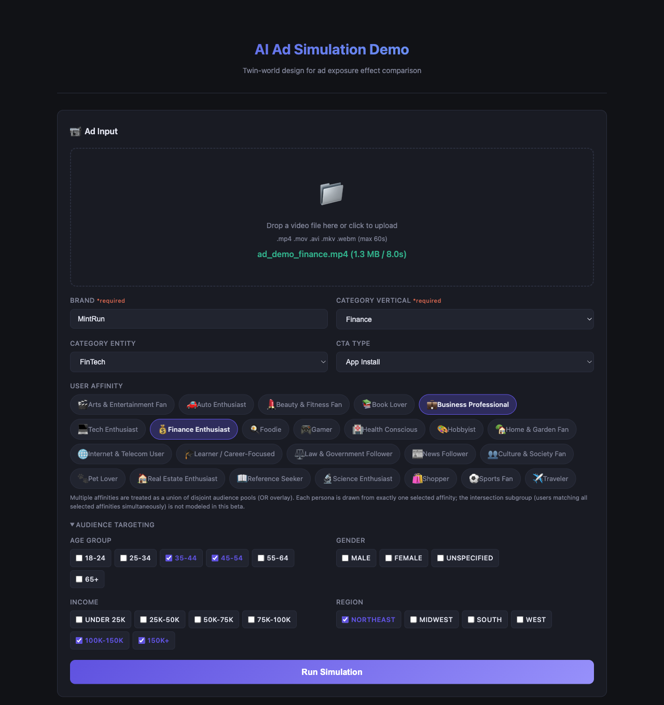
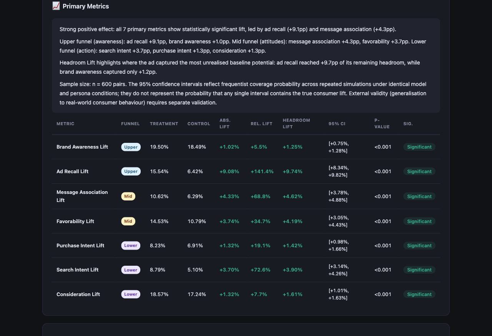
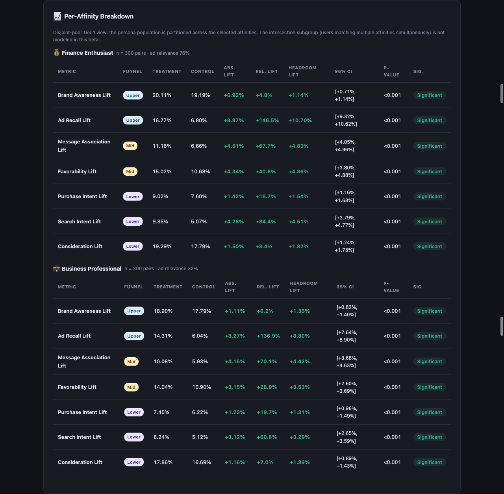
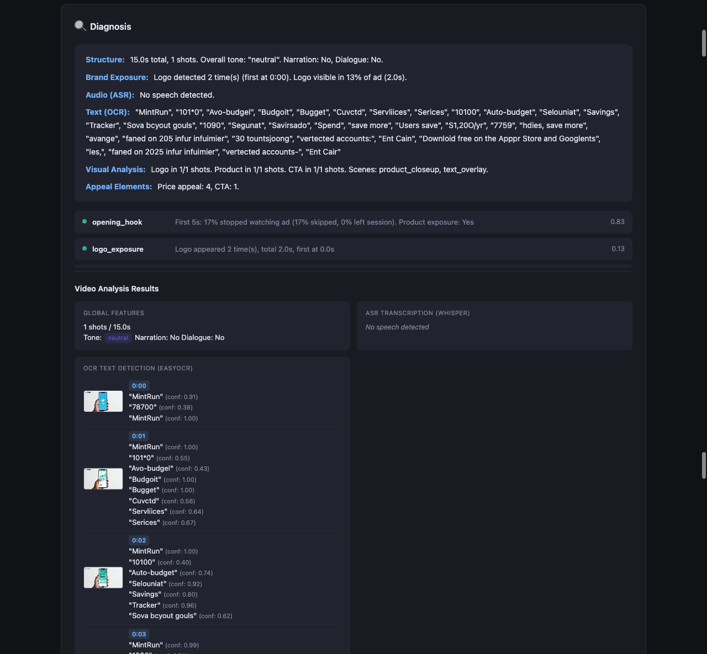
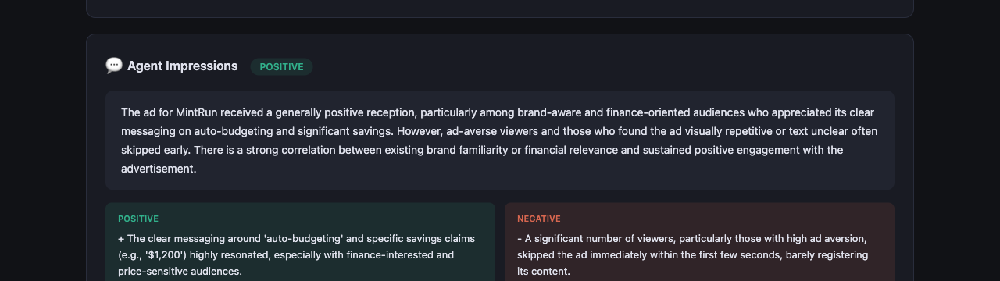
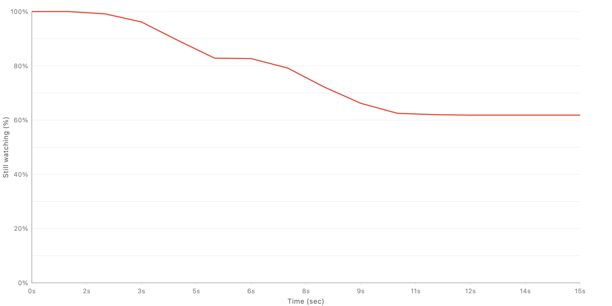

# Demo: Finance Ad Simulation Output

This demo shows the type of output produced by AI Video Ad Simulation after
running a synthetic pretest on an AI-generated fictional finance ad.

The brand, product, and video creative in this demo are fictional. The results
are intended to illustrate the output format and interpretation workflow, not
to represent real campaign performance.

## Demo Assets

| Asset | Purpose |
| --- | --- |
| [ad_demo_finance.mp4](demo/ad_demo_finance.mp4) | Input ad creative used for the simulation |
| [report.pdf](demo/ad_demo_finance_result/report.pdf) | Exported visual report |
| [agents.csv](demo/ad_demo_finance_result/agents.csv) | Per-agent qualitative impressions |
| [README.txt](demo/ad_demo_finance_result/README.txt) | Metadata for the exported result bundle |

## Scenario

The demo simulates a short video ad for `MintRun`, a fictional finance app.
The ad is evaluated against synthetic viewer personas sampled across two
selected affinity pools:

| Field | Value |
| --- | --- |
| Brand | MintRun |
| Category | Finance |
| Selected affinities | Business Professional OR Finance Enthusiast |
| Synthetic pairs | 600 treatment/control pairs |
| Seeds | 3 |
| Processing time shown in WebUI | 6m 30s |
| Pipeline version | 2026-05-09 |
| Simulation ID | sim-7300e8bf07b2 |

The WebUI reports a positive overall verdict:

> Significant positive effect detected in 7 metric(s).

## Primary Metrics

The primary metric table compares treatment agents who received the ad
stimulus against matched control agents. The table below mirrors the PDF
report columns, including relative lift, headroom lift, p-values, and
significance markers.

| Metric | Funnel | Treatment | Control | Abs. Lift | Rel. Lift | Headroom Lift | 95% CI | p | Sig. |
| --- | --- | ---: | ---: | ---: | ---: | ---: | --- | ---: | --- |
| brand_awareness_lift | Upper | 19.50% | 18.49% | +1.02% | +5.5% | +1.25% | [+0.75%, +1.28%] | 0.0000 | *** |
| ad_recall_lift | Upper | 15.54% | 6.42% | +9.08% | +141.4% | +9.74% | [+8.34%, +9.82%] | 0.0000 | *** |
| message_association_lift | Mid | 10.62% | 6.29% | +4.33% | +68.8% | +4.62% | [+3.78%, +4.88%] | 0.0000 | *** |
| favorability_lift | Mid | 14.53% | 10.79% | +3.74% | +34.7% | +4.19% | [+3.05%, +4.43%] | 0.0000 | *** |
| purchase_intent_lift | Lower | 8.23% | 6.91% | +1.32% | +19.1% | +1.42% | [+0.98%, +1.66%] | 0.0000 | *** |
| search_intent_lift | Lower | 8.79% | 5.10% | +3.70% | +72.6% | +3.90% | [+3.14%, +4.26%] | 0.0000 | *** |
| consideration_lift | Lower | 18.57% | 17.24% | +1.32% | +7.7% | +1.61% | [+1.01%, +1.63%] | 0.0000 | *** |

In this sample, the strongest lift is in ad recall, followed by
message association, search intent, and favorability. Lower-funnel metrics
also move positively, but with smaller absolute lift.

## Segment And Affinity Views

The demo output includes both segment-level and affinity-level breakdowns.
The WebUI partitions the synthetic population into six persona segments:

| Segment | Pairs |
| --- | ---: |
| ad_averse_business_industrial | 60 |
| ad_averse_finance | 60 |
| brand_aware_business_industrial | 90 |
| brand_aware_finance | 90 |
| brand_unaware_business_industrial | 150 |
| brand_unaware_finance | 150 |

## Video Analysis Output

The diagnosis section explains how the ad creative was interpreted before
agent simulation.

| Component | Sample output |
| --- | --- |
| Structure | 1 detected shot, neutral tone |
| ASR | No speech detected |
| OCR | Brand and product text such as `MintRun`, `Auto-budget`, `Savings`, and `Spend save more` |
| Visual tags | Logo, product, CTA, product closeup, text overlay |
| Brand exposure | Logo detected 2 times, first at 0:00 |
| Price appeal | 4 price signals detected |
| CTA | 1 app-install CTA event detected |

The diagnosis also attributes likely drivers of performance. In this sample,
the opening hook and price appeal are positive factors, while CTA effectiveness
is more neutral.

## Agent Impressions

The exported `agents.csv` contains one row per sampled treatment-side agent
impression:

| Column | Meaning |
| --- | --- |
| `agent_id` | Synthetic agent identifier |
| `segment` | Persona segment assigned to the agent |
| `sentiment` | Overall qualitative sentiment |
| `impression_text` | Natural-language summary of how the agent reacted |
| `key_reactions` | Pipe-separated reaction tags |

This demo bundle contains 200 sampled agent impressions. The sentiment mix is:

| Sentiment | Count |
| --- | ---: |
| positive | 109 |
| neutral | 56 |
| negative | 32 |
| mixed | 3 |

The WebUI snapshot also shows qualitative themes. Positive reactions center on
auto-budgeting, savings claims, brand recognition, and finance relevance.
Negative reactions are mostly driven by ad aversion, early skipping, and the
creative losing attention in the latter half.

Note: the WebUI snapshot includes a fallback notice for the agent-impression
panel. In that run, qualitative impression text was generated using rule-based
heuristics because the external LLM API was unavailable. The primary metric
tables and exported result structure still illustrate the normal output shape.

## Survival Curve

The survival curve shows the share of treatment agents that remain watching
the ad over time. In this sample, retention stays high during the opening
seconds, declines through the middle of the 15-second creative, and stabilizes
at roughly 62% by the end. This helps identify where synthetic viewers lose
attention or skip, complementing both the lift metrics and agent impressions.

## How To Read This Demo

Use the files together:

1. Start with the embedded WebUI screenshot above for the completed simulation
   view.
2. Use [report.pdf](demo/ad_demo_finance_result/report.pdf) as the exported
   shareable report.
3. Use [agents.csv](demo/ad_demo_finance_result/agents.csv) when inspecting
   individual synthetic viewer reactions or segment-level language patterns.
4. Use [README.txt](demo/ad_demo_finance_result/README.txt) to confirm result
   metadata and bundle contents.

The key point of the demo is that the system does not only output a single
score. It produces a layered result: causal lift estimates, confidence
intervals, funnel-stage interpretation, segment differences, creative
diagnosis, and per-agent qualitative reactions.

## Interpretation Caveat

These numbers are simulated estimates from synthetic AI agents. They are useful
for pretest comparison, creative diagnosis, and prioritization before media
spend, but they are not a substitute for calibration against real campaign
delivery and measurement data.
