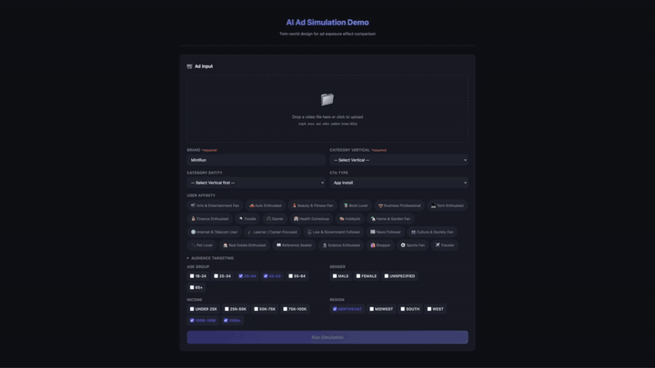
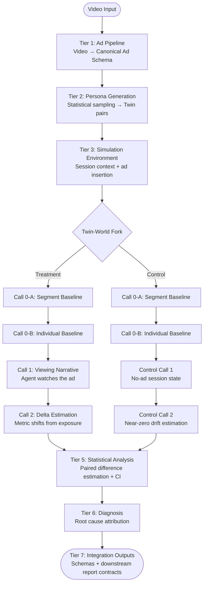

# AI Video Ad Simulation: Synthetic Pretest System


A synthetic pretest platform that simulates video ad delivery to AI agents (synthetic viewers) using Chain of Thought (CoT) reasoning to model how target audiences process and respond to ad exposure — enabling advertisers to estimate brand lift metrics before real-world deployment.

**License:** [BSL 1.1](LICENSE.md) (converts to Apache 2.0 after 5 years)

**Demo:** [Finance ad simulation output example](DEMO.md)

---

## Overview



Instead of buying media inventory and measuring real audiences after the fact, this system delivers video ads to **AI agents acting as synthetic viewers** — and measures the effect computationally, before any real budget is spent.

Each AI agent is initialized with a structured persona (demographics, brand priors, behavioral propensities) sampled from public population statistics. The agent then processes the ad through a multimodal LLM and its internal state is updated to reflect exposure. Comparing agents who saw the ad (Treatment) against statistically identical agents who did not (Control) yields a causal estimate of ad effectiveness.

### Pipeline Overview



<!-- Static fallback:  -->

The LLM-Agent Simulation Loop shares baseline estimation across both worlds (Call 0-A/0-B), then runs symmetric CoT-based measurement flows: Treatment sees the ad and estimates exposure-driven response deltas; Control receives no ad stimulus and estimates only counterfactual no-ad drift. The only causal difference between the two paths is ad exposure.

### Metrics Estimated

The paired comparison produces lift estimates (with confidence intervals) across seven brand-health dimensions, ordered along the brand funnel:

- **Upper funnel (awareness):** brand awareness lift, ad recall lift
- **Mid funnel (attitudes):** message association lift, favorability lift (unipolar [0, 1] — `0` means no positive feeling, `1` means maximally favorable)
- **Lower funnel (action):** consideration lift, purchase intent lift, search intent lift

For every metric the report also surfaces **Headroom Lift** (`Abs Lift / (1 − Control)` — the share of the remaining baseline headroom captured by the ad; suppressed when the control rate exceeds 0.90 because the denominator becomes unstable) and a deterministic 4-paragraph synthesis above the metrics table that summarises the funnel-level story without using an LLM. The system also outputs **root cause analysis** and **actionable improvement hypotheses** based on ad structure and agent feedback.

---

## Design Philosophy

### The Problem: Ad Performance Is Empirical by Default

Traditionally, the only way to know whether a video advertisement will work is to run it — deploy real media budget, reach real audiences, and measure what happens afterward. This creates an expensive feedback loop: creative teams produce an ad, planners buy inventory, and only after real-world exposure do brands discover whether the execution moved the metrics they cared about. Each iteration cycle costs money, and the learnings arrive too late to inform the current campaign.

### Synthetic Pretesting with AI Agents

This project takes a different approach: instead of exposing ads to real audiences, the system initializes **AI agents as synthetic viewers**. Each agent carries a set of demographic and psychographic state variables — drawn from publicly available population statistics (primarily the American Community Survey (ACS) and the NTIA Internet Use Survey) — that represent a member of the intended target segment. The agent then "watches" the ad through a multimodal model and its internal state variables are updated to reflect the exposure.

The essence of this architecture is **making AI agents behave like humans**. Personas are modeled as structured state variables, not open-ended personality narratives. This is an intentional choice: state variables are observable, comparable, and constrained, which makes their changes after ad exposure interpretable as measurable deltas rather than free-form impressions.

### Canonical Causal Estimation Pipeline

Ad effectiveness is not simply "how did you feel after watching?" — it is the **difference** between a world where you watched the ad and a world where you did not. The pipeline operationalizes this through shared baseline calls plus arm-specific LLM measurement calls:

1. **Call 0-A (Segment Baseline):** Estimates 7 brand-lift metrics at the segment level — what would a typical member of this demographic cell score *without* the ad? This anchors all subsequent per-persona estimates.
2. **Call 0-B (Individual Baseline):** Adjusts the segment baseline for each persona's specific attributes (ad tolerance, brand familiarity, price sensitivity, etc.), producing per-persona prior distributions.
3. **Treatment Call 1/2:** Treatment agents watch the ad, produce a first-person viewing narrative, and then estimate exposure-driven deltas from their individual baselines.
4. **Control Call 1/2:** Control agents receive no ad stimulus, estimate normal no-ad session state, and then estimate small counterfactual drift around the same individual baselines.

**Treatment vs. Control:** The current implementation shares Call 0-A and Call 0-B across each twin pair, then runs two arm-specific calls. Treatment Call 1 builds the ad-viewing narrative and Treatment Call 2 estimates metric deltas from that narrative. Control Call 1 estimates no-ad baseline session state and Control Call 2 estimates small no-ad drift around the same individual baselines. Earlier Beta-sampling control logic has been superseded by this symmetric LLM control path.

### Mathematical View

At a high level, the system treats an ad video as a structured stimulus:

```math
A = \Phi(V, m) = \{x_t\}_{t=1}^{T}
```

where \(V\) is the input video, \(m\) is campaign metadata, and each \(x_t\)
is a time-indexed representation of what the viewer can observe at second
\(t\): visual features, spoken text, on-screen text, brand exposure, product
presence, and CTA signals.

Each synthetic viewer is evaluated through a paired twin-world design:

```math
P_i^T = P_i^C
```

The treatment and control twins share the same persona state. The only
intervention is whether the ad stimulus is present.

The system estimates a baseline and then compares treatment and control
outcomes:

```math
b_i = f_0(P_i)
```

```math
Y_i^T = f_T(P_i, A, b_i), \quad
Y_i^C = f_C(P_i, b_i)
```

For each brand-lift metric \(k\), the paired difference is:

```math
d_{ik} = Y_{ik}^{T} - Y_{ik}^{C}
```

and the estimated lift is:

```math
\hat{\tau}_k = \frac{1}{N}\sum_{i=1}^{N} d_{ik}
```

Headroom Lift expresses how much of the remaining control-world headroom the
ad captures:

```math
\mathrm{HeadroomLift}_k =
\frac{\hat{\tau}_k}{1 - \bar{Y}_k^C}
```

Reported estimates may pass through an internal null-stimulus bias correction
layer to reduce systematic LLM response drift. The calibration procedure is
intentionally not described in this public README.

### Known Limitations

Two structural limitations are worth stating explicitly.

**No real-world calibration data.** The system operates without ground truth — there is no real ad delivery data to validate against. Internal bias correction may be applied to reduce systematic LLM response drift, but the surviving estimates are still anchored to LLM judgments rather than observed campaign outcomes. They are directionally useful for relative comparisons (ad variant A vs. B) but are not numerically calibrated against real engagement. The architecture currently has no feedback path from simulation results back to the baseline estimators or prompt tuning.

**Chain of Thought self-reinforcement.** Because Call 2 conditions on Call 1's narrative output, the same model's prior beliefs propagate forward through the pipeline. If the LLM consistently over- or under-represents certain response patterns in viewing narratives, those biases compound into the final delta estimates. The system mitigates this with deterministic funnel coherence clamping (hard constraints on metric ordering), but this corrects logical contradictions — not magnitude errors. Addressing this limitation is an open area for future work, including ensemble sampling across models and external calibration anchors from real brand lift studies.

**Hand-tuned persona affinity constants.** The persona affinity presets and the relevance/boost coefficients used during simulation are defined by manual heuristic judgment (each persona type carries 3–6 weighted vertical interests; relevance decay and behavior-boost magnitudes are fixed constants). These constants have not been fit to real ad delivery logs or validated against observed engagement rates. They govern directional relative comparisons between ad variants but carry no quantitative calibration. Future versions may derive these values from real delivery logs or from LLM-based persona-ad match inference.

---

## Architecture

The pipeline consists of 7 tiers:

```
Video Input
  -> [Tier 1] Ad Pipeline        : Video -> Canonical Ad Schema
  -> [Tier 2] Persona Generation  : Statistical distributions -> Twin persona pairs
  -> [Tier 3] Simulation Env      : Session context + ad insertion
  -> [Tier 4] LLM-Agent Simulation Loop : CoT-based baseline + causal response estimation
  -> [Tier 5] Statistical Analysis : Paired difference estimation + CI
  -> [Tier 6] Diagnosis            : Root cause attribution + improvements
  -> [Tier 7] Integration Outputs  : schemas + downstream report contracts
```

### Tier 1: Ad Pipeline (`src/ad_pipeline/`)

Processes raw video into a structured canonical schema:
- Video normalization (FFmpeg), shot segmentation (PySceneDetect)
- Audio transcription (ASR), on-screen text extraction (OCR)
- Visual feature tagging (emotion, brand/product visibility, price signals, CTA events)

### Tier 2: Persona Generation (`src/persona/`)

Generates personas as **state-variable collections** (not natural language profiles):
- Demographics from public statistics (ACS and NTIA Internet Use Survey)
- Brand prior familiarity, ad tolerance, price sensitivity
- Interest vectors, search/click propensity, session behavior
- Twin-pair matching for controlled comparison (FR-09B)
- **Multi-affinity OR overlay:** supports single or multiple affinity presets via `build_affinity_templates_multi`; selected affinities are treated as disjoint pools and produce per-affinity `affinity_breakdown` metrics when ≥ 2 affinities are selected

### Tier 3-4: LLM-Agent Simulation Loop

The public core defines the schema contracts and protocol interfaces used by the LLM-Agent Simulation Loop:
1. **Call 0-A** (Segment Baseline): 7-metric baseline at the demographic cell level
2. **Call 0-B** (Individual Baseline): Per-persona adjustment anchored to segment means
3. **Treatment Call 1/2**: ad viewing narrative, then exposure-driven metric deltas
4. **Control Call 1/2**: no-ad session state, then near-zero counterfactual drift

Video input is first converted into the canonical ad schema. A deployment-specific runtime can pass that structured timeline into CoT-based AI-agent calls through the public protocol interfaces.

### Tier 5-6: Statistics + Diagnosis

- Paired difference estimation with confidence intervals
- Statistical power planning for required twin-pair counts and repeated seeds
- Root cause attribution and improvement hypothesis generation

### Tier 7: Integration Outputs

- JSON-compatible result contracts for downstream reporting
- Protocol interfaces for deployment-specific orchestration

---

## Repository Structure

This repository contains the public core modules exported for review and integration. Deployment-specific orchestration is intentionally kept outside the public core.

```
ai-video-ad-simulation-core/
├── src/
│   ├── config_loader.py          # TOML configuration loader
│   ├── ad_pipeline/              # Video processing pipeline (FFmpeg, ASR, OCR)
│   ├── ingestion/                # Public data schemas + demographic distributions
│   │   ├── public_data_schemas.py
│   │   ├── joint_demographic_distribution.py
│   │   ├── yt8m_vocabulary.py
│   │   └── ad_input_service.py
│   ├── persona/
│   │   ├── models.py             # Persona data models (demographics, priors)
│   │   ├── targeting.py          # Audience targeting criteria
│   │   ├── behavior_priors.py    # Behavior-prior providers (incl. LLM-elicited)
│   │   └── _baseline_schema.py   # Shared invariant / schema / report-shape helpers
│   └── analysis/
│       └── power_planner.py      # Statistical power planning
├── core/
│   └── protocols.py              # Strategy-pattern interfaces (LLMClient, PromptProvider, SimulationOrchestrator)
├── prompts/
│   └── behavior_baseline/        # Versioned LLM-elicitation prompt bundle (public assumption / reproducibility artifact)
│       ├── v1/                   # immutable (legacy fallback)
│       └── v2/                   # immutable (current default)
├── config/
│   └── core.toml                 # Public configuration (power, pipeline defaults)
├── vocab/
│   └── youtube8m/vocabulary.csv  # Category vocabulary (kept outside data/ so the runtime volume mount does not hide it)
├── demo/                         # Curated demo artifacts (screenshots, GIFs, sample result)
├── tests/                        # Unit tests for CORE modules
├── DEMO.md                       # Finance ad simulation output example
├── overall_concept.png           # Architecture concept image
├── LICENSE.md                    # BSL 1.1
├── pyproject.toml
└── README.md
```

`core/protocols.py` defines the strategy-pattern interfaces a deployment-specific runtime implements. The proprietary orchestration, LLM measurement, reporting, and web/API layers are intentionally kept **outside** this public core — see *Repository Scope and Usage Requirements* below for the exact boundary.

---

## Key Design Principles

### Twin-World Separation
Complete isolation of treatment and control agents. Identical initial state, persona attributes, and external context. The **only** difference is ad exposure. Treatment agents receive the ad timeline in Call 1 and estimate exposure deltas in Call 2; control agents receive no ad timeline and estimate only no-ad baseline state plus small counterfactual drift. Paired design enables precise difference estimation.

### State-Variable Personas
Personas are numeric/categorical attribute vectors, not natural language profiles. This enables statistical sampling, reproducibility, and controlled variation within segments.

### Funnel Coherence Clamping
Metric outputs pass through deterministic post-hoc checks that preserve basic marketing funnel consistency across awareness, consideration, and intent. The public README describes the principle only; the exact constraint set is treated as implementation detail.

### Fallback-First Robustness
Deterministic rule-based fallbacks ensure the system produces results even when LLM calls fail or are unavailable.

---

## Repository Scope and Usage Requirements

This public core repository is **not a standalone runnable application**. Installing
`ai-video-ad-simulation-core` by itself does not provide the deployment-specific
orchestration needed to run an end-to-end ad simulation.

The public core is intended for architecture review, schema/model reuse, and
integration into a larger runtime package.

To use these modules in a working system, an integrating runtime must provide:

- Python >= 3.11
- FFmpeg installed and available on `PATH` when using the video ad pipeline
- Deployment-specific orchestration implementing the interfaces in `core/protocols.py`
- Hosted multimodal model access, prompt orchestration, credentials, and runtime
  configuration outside this public core
- Any proprietary calibration, reporting, web/API, or production execution layers
  required by the deployment

### What this repository includes

- The Tier 1 ad pipeline (`src/ad_pipeline/`) used to turn a video into the
  canonical ad schema.
- Public persona scaffolding: `models.py`, `targeting.py`, `behavior_priors.py`,
  and the shared invariant / schema / report-shape helpers under
  `src/persona/_baseline_schema.py`.
- Public ingestion utilities for the demographic and vertical vocabularies
  (`src/ingestion/`) plus the YouTube-8M vocabulary at `vocab/youtube8m/`.
- Statistical power planning under `src/analysis/power_planner.py`.
- The protocol surface in `core/protocols.py` that defines the boundary an
  integrating runtime must implement.
- `prompts/behavior_baseline/` — the versioned LLM elicitation prompt bundle
  consumed by `behavior_priors.py`. This bundle is included as a **public
  assumption / reproducibility artifact**: it documents the qualitative
  band-elicitation methodology that anchors the simulation's prior surface.
  These prompts are NOT empirical calibrations against real campaign data,
  and the bundle ships verbatim because every byte feeds the `prompt_hash`
  invariant enforced by the loader (see
  [`prompts/behavior_baseline/README.md`](prompts/behavior_baseline/README.md)).

### What this repository does NOT include

The following layers are intentionally kept out of this public core because
they encode the deployment's competitive surface. They live in the private
runtime package and must be supplied by the integrator:

- Empirical calibration pipelines and the null-ad calibration constants
  used by the production runtime.
- The LLM measurement stack and its prompt control logic (segment / individual
  baseline calls, treatment / control narrative calls, delta estimation).
- Twin-world factory, simulation models, segment-level statistical models,
  and the affinity / population-generation modules that compose the
  Tier 2-4 production simulator.
- Reporting (PDF / CSV / dashboard) and diagnosis surfaces.
- The production HTTP application surface, its authentication gate,
  rate-limit / quota counters, and the per-object authorisation
  enforcement, plus the production experiment dispatch layer.

The export script (`scripts/export_core.sh` in the upstream repository)
enforces these boundaries with explicit deny-path and deny-content
patterns, so the public artifact stays aligned with this scope statement.

---

## Monthly LLM-Elicited Behavior Baseline

The behavior-prior backbone of Tier 2 can be sourced from a monthly batch
pipeline that elicits qualitative bands from an ensemble of multimodal LLMs,
intersects them across models, validates 31 snapshot invariants, and
atomically promotes the result to the live active snapshot. These priors
are explicit simulation assumptions — **not** empirical calibrations
against real campaign data.

> **Public-core note:** the `generate → validate → swap` scripts
> (`scripts/generate_behavior_baseline.py`, `scripts/validate_baseline_swap.py`,
> `scripts/swap_baseline.py`) and the `POST /api/simulate` endpoint described in
> this section live in the **private runtime**, not in this public core. A
> public-core checkout ships the versioned prompt bundle
> (`prompts/behavior_baseline/`) and the loader/provider in
> `src/persona/behavior_priors.py`, but **not** the operator scripts or the
> web/API layer. The workflow below documents the upstream operator procedure;
> it is not runnable from a public-core checkout alone.

### File layout

```
behavior_baselines/
  _pending/YYYY-MM.json       (candidate snapshot from generator)
  YYYY-MM.json                (committed live snapshot)
  active.json                 ({"version": "YYYY-MM"} pointer)
  .swap.lock                  (filelock handle — do not remove during normal operation)
  audit.jsonl                 (append-only JSON Lines audit)

prompts/behavior_baseline/
  v1/                         (immutable; legacy fallback only)
    system.txt
    user.txt
    attribute_descriptions.json
    output_schema.json
  v2/                         (default — click_propensity scale clarification;
    system.txt                 also immutable; new revisions go to v3/, etc.)
    user.txt
    attribute_descriptions.json
    output_schema.json
```

The swap script never deletes `.swap.lock`. Do not remove it during
normal operation; the file persists by design as a `filelock` handle.
If a swap process exits abnormally and a subsequent run blocks on lock
timeout, an operator may delete `.swap.lock` manually after confirming
no other swap is in flight (e.g., via `ps` / `lsof`).

### Three-command workflow

The pipeline is `generate → validate → swap`. The first run uses
`--bootstrap-mode` (validator) and `--bootstrap` (swap) because no
`active.json` exists yet. Subsequent monthly runs drop both flags.

**Bootstrap (first run only)**

```bash
# 1. Elicit + write _pending/YYYY-MM.json. The generator's cost guard needs a
#    config overlay providing the per-batch generation budget + pricing tables;
#    point SIMULATION_CONFIG_OVERLAY_PATH at your overlay or the run fails
#    closed (exit 2).
SIMULATION_CONFIG_OVERLAY_PATH=<your-overlay.toml> \
    python scripts/generate_behavior_baseline.py

# 2. Validate against the (absent) active state
python scripts/validate_baseline_swap.py \
    --pending behavior_baselines/_pending/YYYY-MM.json \
    --json-report /tmp/baseline_report.json \
    --bootstrap-mode

# 3. Lock-first atomic swap. Writes behavior_baselines/YYYY-MM.json,
#    updates active.json, appends bootstrap_swap to audit.jsonl.
python scripts/swap_baseline.py \
    --pending behavior_baselines/_pending/YYYY-MM.json \
    --json-report /tmp/baseline_report.json \
    --bootstrap
```

**Monthly run (subsequent months)**

Identical command sequence, without `--bootstrap-mode` / `--bootstrap`
(the generator still needs `SIMULATION_CONFIG_OVERLAY_PATH` set — see step 1
above):

```bash
SIMULATION_CONFIG_OVERLAY_PATH=<your-overlay.toml> \
    python scripts/generate_behavior_baseline.py

python scripts/validate_baseline_swap.py \
    --pending behavior_baselines/_pending/YYYY-MM.json \
    --json-report /tmp/baseline_report.json

python scripts/swap_baseline.py \
    --pending behavior_baselines/_pending/YYYY-MM.json \
    --json-report /tmp/baseline_report.json
```

Validator and swap share the same `--json-report` path. The validator
writes it; the swap reads it inside its FileLock region and compares
against a fresh in-lock validation to detect tampering or state changes
that happen between the two invocations.

> **Operators (private/SaaS deployment):** the full monthly procedure —
> secrets/API-key handling, cost guard, failure-recovery matrix,
> provider-outage degradation, rollback, and audit-log review — lives in
> `docs/operator_runbook.md` in the **private** repository. That runbook is
> intentionally NOT part of this public-core distribution, so the path
> resolves only in the private repo.

### Drift flags

Three flags accept-on-decision the corresponding monthly drift signals.
Each is a **validator-side violation suppressor**: when the flag is
passed, the matching `drift_*` violation is filtered out of the report
before `exit_code` is computed via priority dispatch. No dedicated audit
entry is emitted for the allow itself; the only side effect is the
absent violation in the report. (For visible operator audit, use
`--force`, which writes `forced_swap` when it actually bypasses
non-empty bypassable violations.)

| Flag | Suppresses | When to pass it |
|------|------------|-----------------|
| `--allow-model-change` | `drift_model_set` | Intentional ensemble rotation (provider deprecation, new model adoption). |
| `--allow-ensemble-change` | `drift_ensemble` | Same requested model set, but one model failed this month and the reduction is acceptable. |
| `--allow-prompt-change` | `drift_prompt` | A new `prompts/behavior_baseline/vN/` directory is being adopted. **Never** combine with edits to a previously published `vN/` — those directories are immutable. |

`--allow-prompt-change` never bypasses the invariant-10 prompt-hash
recompute against the **current** prompt files; if the snapshot's
`prompt_hash` no longer matches the on-disk bundle bytes, validation
still fails (code 3 `prompt_hash_mismatch`).

### Forced acceptance (`--force`)

`--force` lets the swap proceed past **non-empty code-1 bypassable
violations only**:

- `magnitude`
- `drift_model_set`
- `drift_ensemble`
- `drift_prompt`

The `forced_swap` audit entry is written **only when `--force` actually
bypasses a non-empty bypassable violation set on the way to a successful
commit**. Running `--force` against a clean (zero-violation) report
proceeds as a normal monthly swap and writes no audit entry — the
operator's `--force` intent is recorded only when it has a load-bearing
effect.

`--force` **cannot** bypass:

- `range`, `allowed_range`, `version_not_newer` (code 1, non-bypassable)
- Any code-3 schema / content / report malformation
- Code 2 missing-file conditions
- Code 5 `disjoint_bands`, code 6 `insufficient_ensemble`, code 7
  `band_too_narrow`
- Code 8 `collision_different_content` / `downgrade_attempt`

Passing `--force` against a non-bypassable category writes
`non_bypassable_force_attempt` to the audit and exits with the
validator's exit code (no commit happens).

### Interpreting exit codes

Both `validate_baseline_swap.py` and `swap_baseline.py` return one of
`{0, 1, 2, 3, 5, 6, 7, 8}`. Exit codes follow **priority dispatch** —
the highest-priority category present wins:

```
priority order:  3 > 8 > 5 > 6 > 7 > 2 > 1
```

| Code | Categories (examples) |
|------|----------------------|
| 0 | (no violations — accept) |
| 1 | `magnitude`, `drift_*`, `range`, `allowed_range`, `version_not_newer` |
| 2 | `missing_pending_file`, `missing_active_pointer`, `missing_active_snapshot`, `missing_prompt_file`, lock timeout |
| 3 | `schema`, `type`, `not_finite`, `prompt_hash_mismatch`, `scenario_envelope_overlap`, `active_pointer_malformed`, `active_snapshot_malformed`, `bootstrap_with_existing_active`, `malformed_report`, ... |
| 5 | `disjoint_bands` |
| 6 | `insufficient_ensemble` |
| 7 | `band_too_narrow` |
| 8 | `collision_different_content`, `downgrade_attempt` |

**Always read the full `violations` list in `--json-report`, not just
the exit code.** Priority dispatch surfaces only the highest-priority
code; lower-priority violations can still be present and hidden behind
the single process exit code. Operators investigating a failure should
inspect every violation category, not the exit code alone.

### Prompt bundle immutability

`prompts/behavior_baseline/vN/` directories are **immutable** once any
snapshot has referenced them. Every byte affects the snapshot's
`prompt_hash`; retroactive mutation (even whitespace or JSON field
reorder) invalidates every snapshot that pinned that version and causes
fail-closed loader errors at runtime.

**Current default**: `--prompt-version v2` (the `click_propensity` scale
clarification revision). `v1` is preserved for legacy fallback.

To revise the elicitation prompt further:

1. Create `prompts/behavior_baseline/v3/` (or `v4`, etc.) — never edit
   an existing bundle in place
2. Copy the four files from the current default (`v2/`) and edit them
   under the new `vN/`
3. Bump the generator's `--prompt-version` default to the new `vN`, OR
   pass `--prompt-version vN` explicitly on the next monthly run
4. Add a frozen SHA-256 row for the new bundle in both
   `tests/unit/test_validate_baseline_swap.py::_FROZEN_BY_VERSION` and
   `tests/integration/test_public_core_export.py::_FROZEN_BUNDLE_SHAS`

Historical snapshots continue to validate against their original `vN/`
bundle. The `v1/` and `v2/` SHA-256 are both gated by a regression test
(`tests/unit/test_validate_baseline_swap.py::test_repo_prompt_bundle_sha256_frozen`)
so accidental writes are surfaced immediately.

### Why `_reject_nonfinite` is retained

Python 3.11's stdlib `json` parser accepts `NaN`, `Infinity`, and
`-Infinity` by default. Every `json.loads` call in this pipeline passes
`parse_constant=_reject_nonfinite` so non-finite literals fail-closed
during parsing rather than silently propagating into snapshot fields,
audit entries, or report SHA computations. If a future contributor
substitutes a different JSON parser, that parser must preserve
equivalent non-finite rejection.

**Do not remove this as "redundant" cleanup.** Python's default JSON
behavior makes the explicit guard load-bearing.

### Disclosure

The LLM-elicited path carries its own user-facing disclosure string,
distinct from the `REACTION_PRIOR_DISCLOSURE` used by the scenario-based
defaults. See `src/persona/behavior_priors.py::LLM_ELICITED_DISCLOSURE`
for the canonical wording; it must accompany any artifact that reports
behavior-prior bands sourced from a monthly snapshot.

### Runtime Integration: Selecting LLM-Elicited Baseline (Phase 2A)

Once a monthly snapshot is committed (i.e. `behavior_baselines/active.json`
exists and references a valid `YYYY-MM.json`), simulation runs can opt into
the LLM-elicited behavior baseline by passing `scenario=llm_elicited` to the
`POST /api/simulate` endpoint.

**API-only selection** — Phase 2A does **not** add a UI dropdown for
scenario selection. Operators select the scenario through the existing
`scenario` form field via curl / Postman / typed clients only.

```bash
curl -X POST http://localhost:8000/api/simulate \
  -F "file_id=<uploaded_id>" \
  -F "brand=ExampleBrand" \
  -F "category=fashion" \
  -F "duration_sec=15" \
  -F "cta_type=website_visit" \
  -F "affinity=beauty_fitness" \
  -F "scenario=llm_elicited"
```

**Fail-closed contract (HTTP 400)** — if the active LLM-elicited baseline is
unavailable (missing `active.json`, missing snapshot body, parse error, or
any invariant violation including invariant-10 prompt-hash mismatch), the
endpoint returns HTTP 400 synchronously **before any `sim_id` is issued**:

```json
{"error": "LLM-elicited baseline unavailable: <reason>"}
```

The `<reason>` field is one of three fixed enum values:

| Reason | Meaning |
|---|---|
| `missing` | `active.json` absent OR referenced `YYYY-MM.json` body absent |
| `invariant_violation` | Snapshot fails one of the 31 invariants, including invariant-10 prompt-hash recompute |
| `invalid` | Pre-invariant pointer-level failure (unparseable JSON, non-finite literals, non-dict top-level, version regex mismatch) |

The response body intentionally **does not contain any filesystem path or
raw exception detail** — server-side WARN logs carry the full message for
operator debugging. Daily quota is refunded automatically on this path
(fail-closed errors are operator/configuration issues, not user fault).
Probe defense is layered by the existing `RateLimitMiddleware` (60 req/min/IP)
and the concurrency gate, NOT by daily quota.

**Report fields added in Phase 2A** — JSON reports for any scenario now
contain two new optional fields in `prior_metadata`:

| Field | Value when `scenario=llm_elicited` | Value otherwise |
|---|---|---|
| `behavior_prior_version` | `"YYYY-MM"` (the active snapshot version) | `null` |
| `llm_elicited_disclosure` | The full `LLM_ELICITED_DISCLOSURE` wording | `null` |

The existing `disclosure` field continues to carry `REACTION_PRIOR_DISCLOSURE`
for **all** scenarios; consumers pinning to that string remain compatible.
The markdown report includes an extra `**LLM-Elicited Baseline:**` paragraph
and a version-tagged `Behavioral scenario:` line only when
`scenario=llm_elicited` — legacy scenarios render byte-identical markdown.

**Server-side constant** — `BASELINES_DIR` is a Python module-level constant
in the request handler (`PROJECT_ROOT / "behavior_baselines"`). It must
NEVER be derived from HTTP input. Tests may override it through the
`_build_behavior_prior(..., baselines_dir=...)` kwarg only.

---

## Public Datasets

The system integrates US-appropriate public statistics for **demographic and
context grounding only** — there is no external empirical calibration of
behavioral reaction priors. Reaction metrics are explicit simulation
assumptions; results support **structured comparison between creative
options**, they do not forecast real-world campaign performance.

- **ACS / NTIA**: US demographic and internet-use statistics (drive the joint demographic distribution used for persona sampling)
- **YouTube-8M**: Video category vocabulary and content tags

See `src/persona/behavior_priors.py` (`REACTION_PRIOR_DISCLOSURE`,
`NAS_CALIBRATION_DISCLOSURE`, `PIPELINE_MISSION`) for the canonical
user-facing wording.

---

## License

This project is licensed under the [Business Source License 1.1](LICENSE.md).

The BSL grants read access and non-production use immediately. After the Change Date (5 years from each release), the license converts to Apache 2.0.

**Additional Use Grant:** You may use the Licensed Work for evaluation, development, and testing purposes. Production use of the Licensed Work requires a separate commercial license.

---

## Citation

```bibtex
@software{ai_video_ad_simulation_2026,
  title={AI Video Ad Simulation: Synthetic Pretest System},
  year={2026},
  url={https://github.com/ks582/ai-video-ad-simulation-core}
}
```
